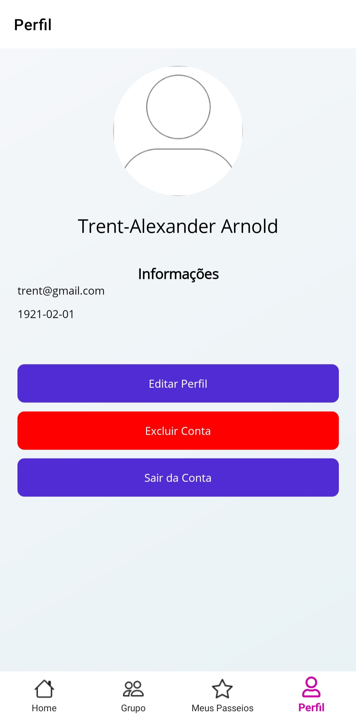
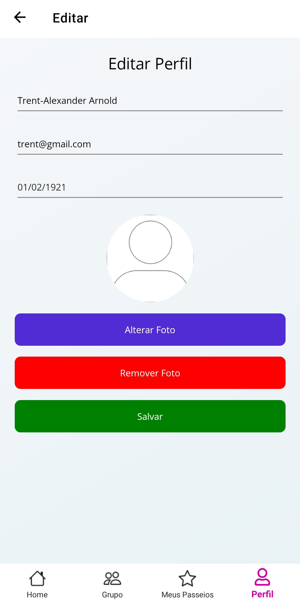
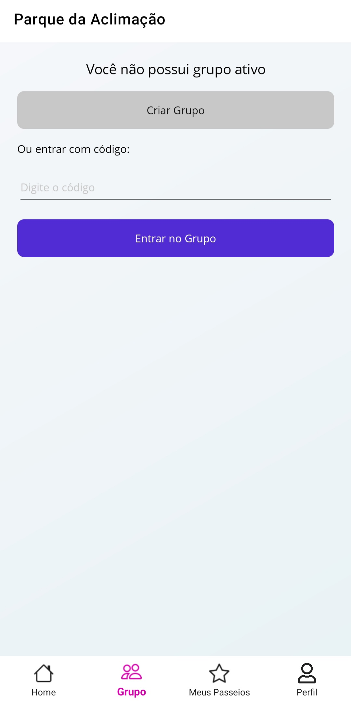
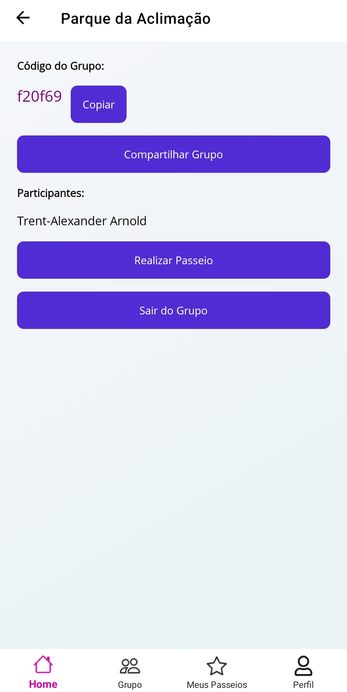

# Demonstração Mobile

## Login

## Cadastro

### Redefinir Senha

## Home 

### Passeios por Categoria

### Detalhes de Passeio

### Avaliações

### Meus Passeios

## Perfil

## Grupo

#### Desenvolvedores:

- FrontEnd: [Iara Laeber](https://github.com/iaralae), [Luciano Ribeiro](https://github.com/LucianoR8)

- BackEnd: [Breno Estevo](https://github.com/Bxnog), [Iara Laeber](https://github.com/iaralae), [Luciano Ribeiro](https://github.com/LucianoR8)