# Demonstração Web

## Página Inicial

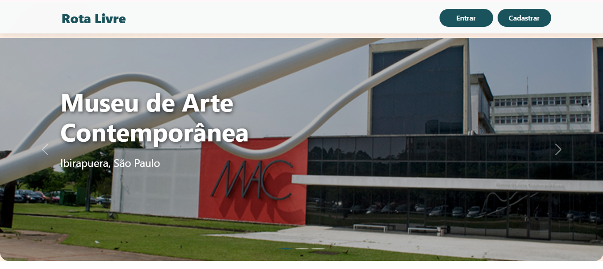

## Cadastro

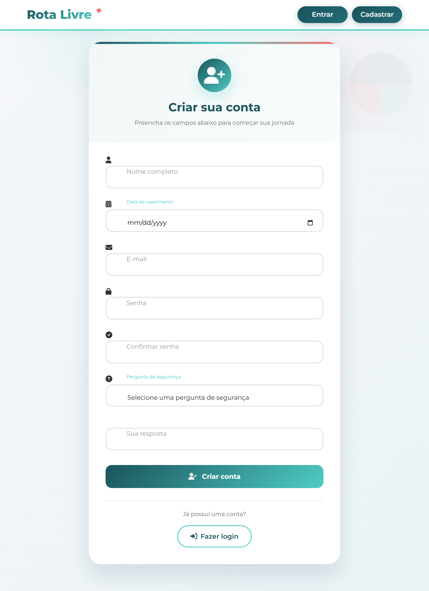

### Cadastro Concluído

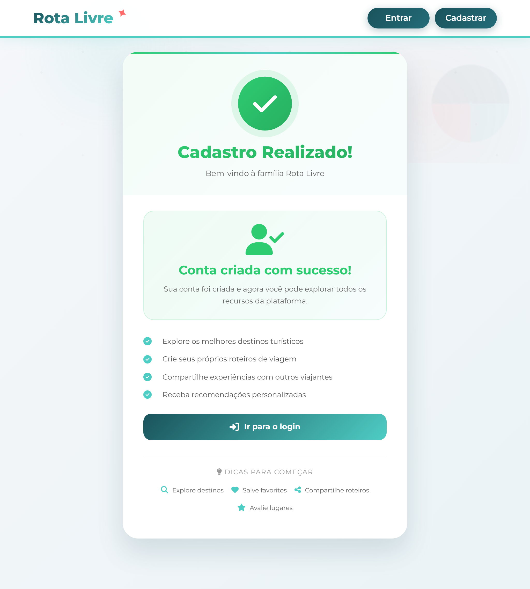

## Login

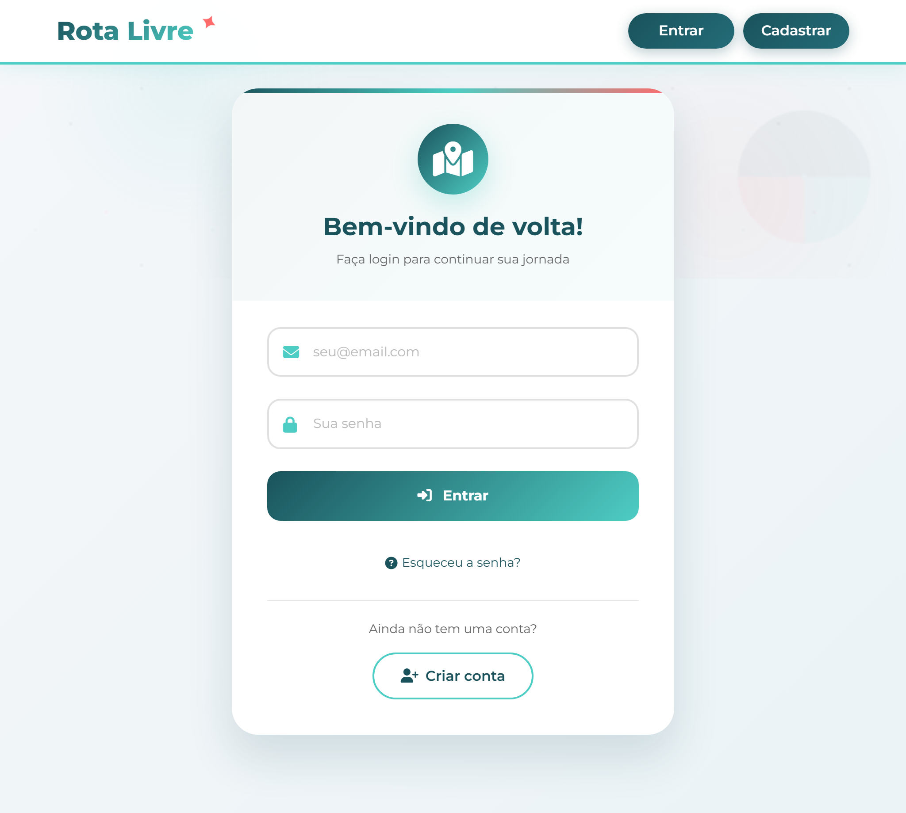

### Redefinir Senha

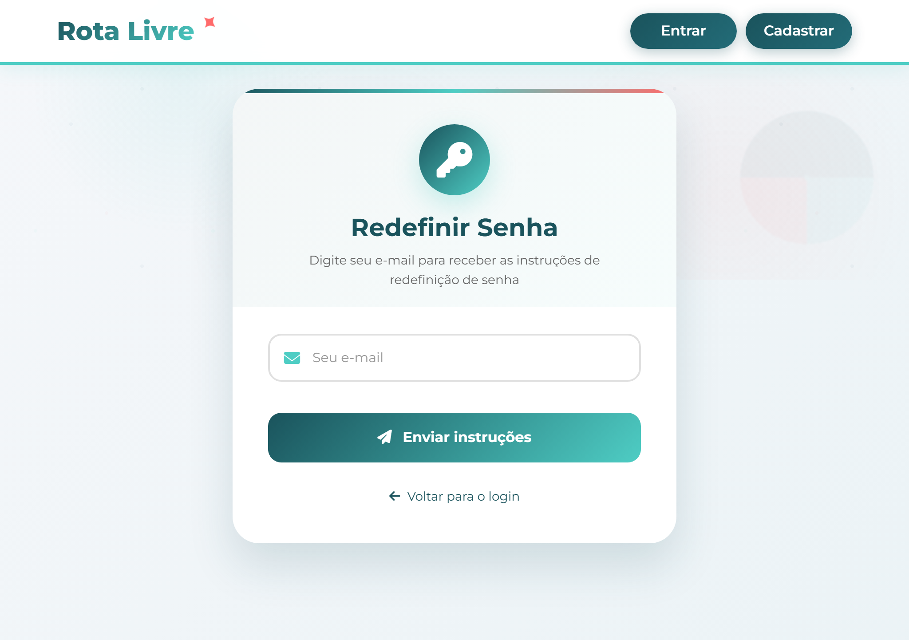
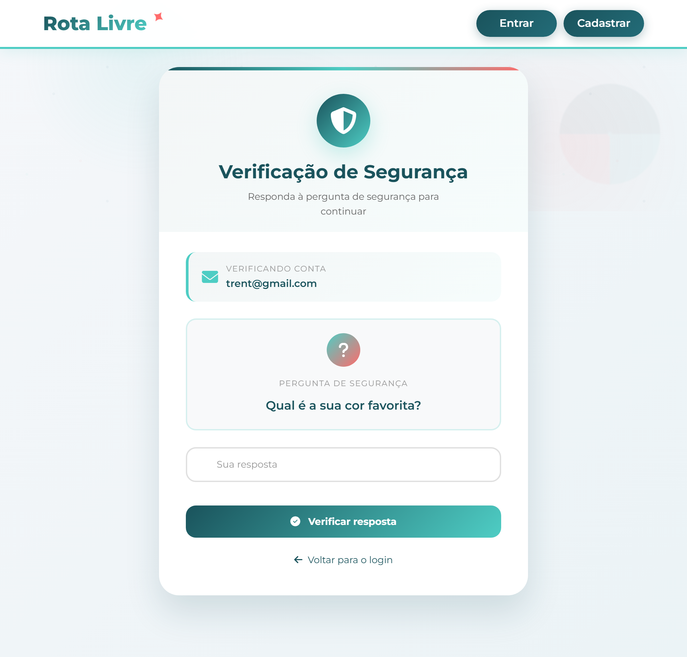
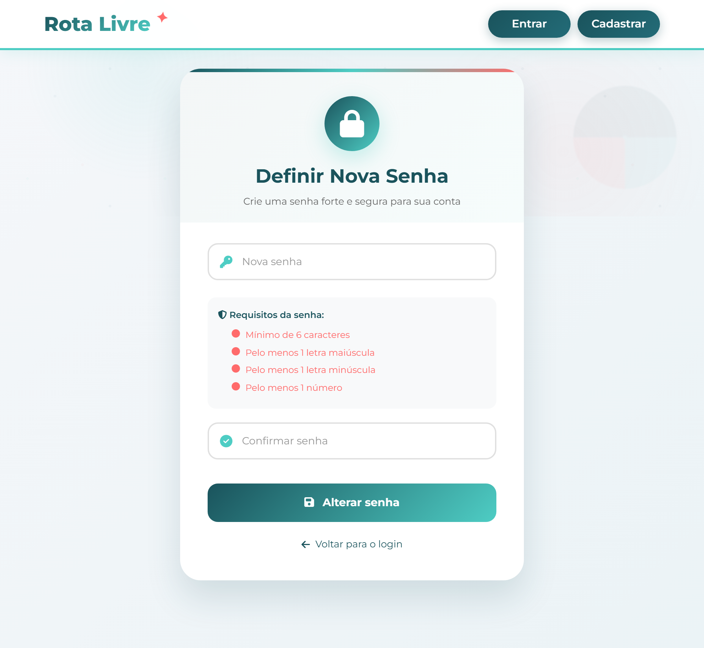
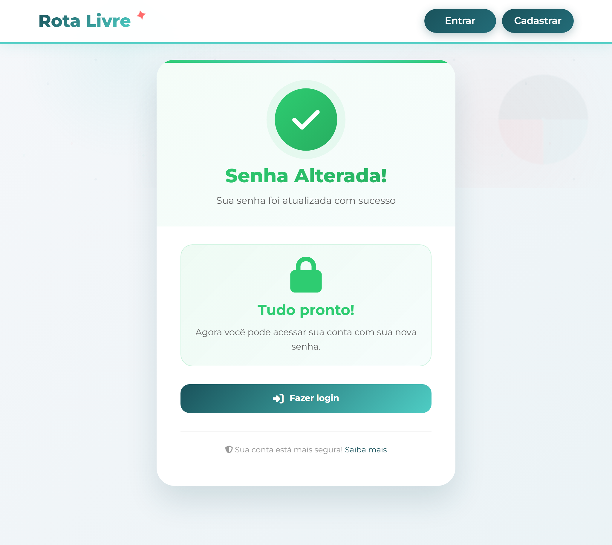

## Home 

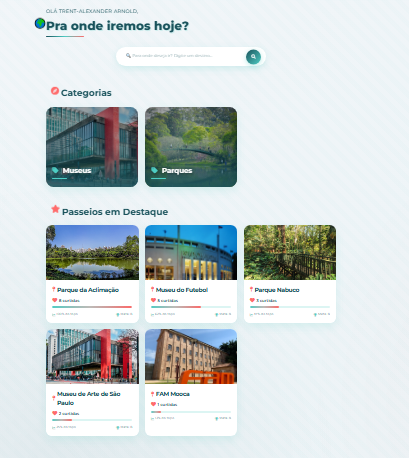

### Passeios por Categoria

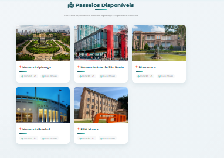
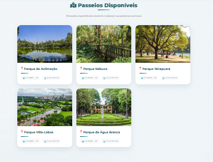

### Detalhes de Passeio

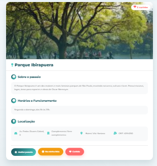

### Avaliações

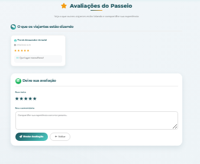

## Meus Passeios

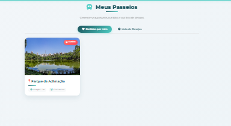
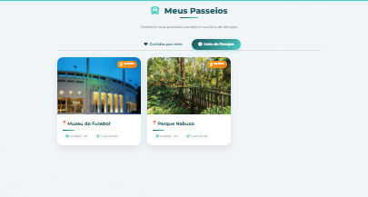

## Perfil

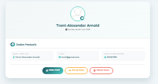
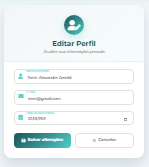

#### Desenvolvedores

 - FrontEnd: [Breno Estevo](https://github.com/Bxnog), [Cauã Macedo](https://github.com/cauamacedo497), Giovanna Alves, [Iara Laeber](https://github.com/iaralae), [Luciano Ribeiro](https://github.com/LucianoR8), [Samira Camargo](https://github.com/SamiraCamargo)

- BackEnd: [Breno Estevo](https://github.com/Bxnog), [Iara Laeber](https://github.com/iaralae), [Luciano Ribeiro](https://github.com/LucianoR8)